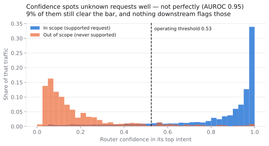
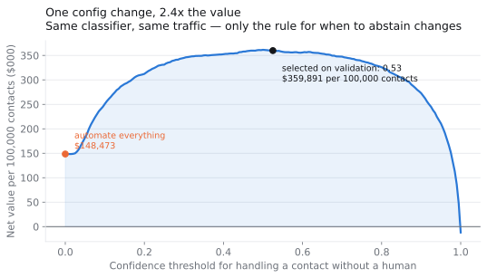
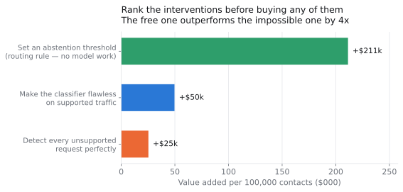
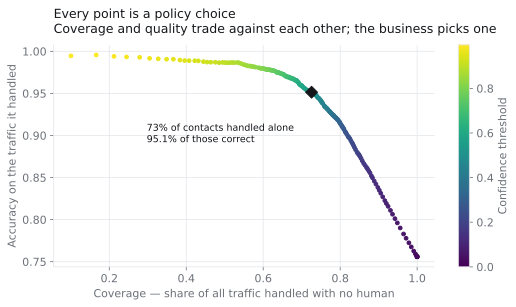
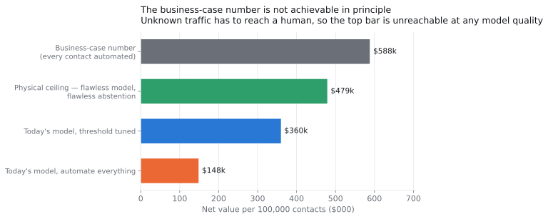
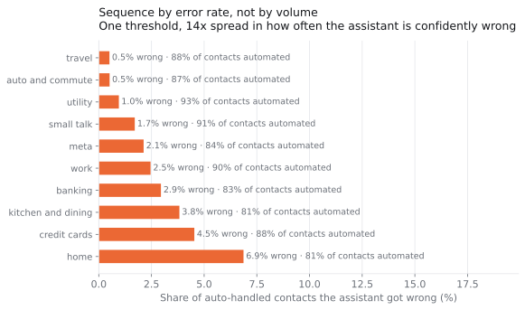
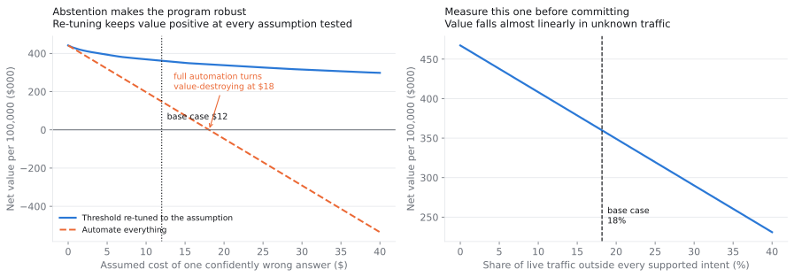

# The 92% that wasn't

**What a support-automation business case gets wrong, and what the number should have been**

---

A vendor demos an AI assistant for your contact centre. It classifies customer requests at **92.4% accuracy**. The slide says: automate the queue, save the cost of a human touch on every contact, here is the payback period.

The accuracy number is real. I reproduced it. The business case built on it is wrong by a factor that matters, and the reason is not that the model is bad — it is that *accuracy is not the quantity the decision depends on*.

This study takes a real benchmark of customer requests, builds the router, and works out the number the business case should have contained: **how much of a live queue can actually be handled with no human, and what that is worth.**

The answer is 72.6% of contacts, worth **$359,891 per 100,000 contacts** — and the single most valuable thing in the program is not the model. It is a routing rule that costs nothing to implement.

---

## Why the demo number is the wrong number

Two things separate a benchmark score from a deployment decision.

**Demos are evaluated on traffic the system was built for.** A router trained on 150 supported intents does not know a 151st exists. Ask it something outside its world and it does not say so — it returns one of its 150 with a confidence score attached. Almost every public intent dataset contains only in-scope traffic, which quietly assumes the hardest input never arrives.

This study uses [CLINC150](https://github.com/clinc/oos-eval) (Larson et al., EMNLP 2019) specifically because it is the rare dataset built to break that assumption: alongside 22,500 in-scope queries across 150 intents, the authors crowdsourced **1,200 out-of-scope queries** — real requests belonging to none of the supported intents — purely to measure what a classifier does when it meets something it was never designed for.

Blend those into the traffic at the rate the dataset's own authors designed for (18.2%), and the 92.4% becomes **75.6%**. Nothing about the model changed. The queue just got realistic.

**Accuracy weights every error the same. A business does not.** A contact the assistant *declines* costs one human touch — the same as today. A contact the assistant answers *confidently and wrongly* costs the human touch anyway, plus the rework, plus whatever the wrong answer did to the customer. These are not equally bad, and no accuracy metric distinguishes them.

So automation is not an accuracy decision. It is a decision about how much traffic you are willing to expose to the second kind of error.

---

## Finding 1 — Confidence catches most unknown requests, and the ones it misses are the dangerous ones



The router's own confidence score turns out to be a good detector of traffic it was never built for: **AUROC 0.95** at separating in-scope from out-of-scope. That is better than I expected, and it is the reason this program is viable at all.

But "good" is not "solved." At the operating threshold, **9.3% of out-of-scope requests still clear the bar** and get answered confidently. Those are the failures nobody counts, because there is no handoff event to log and no ticket reopened — the customer receives a fluent, wrong answer to a question the system never supported, and leaves. At the recommended operating point they are 1.7% of all traffic.

That is the failure mode worth instrumenting for, and it is invisible to every dashboard that measures deflection rate.

---

## Finding 2 — The routing rule is worth 4× a flawless model

This is the finding I would lead with in a steering committee.



Hand every contact to the assistant and the program is worth **$148,473** per 100,000 contacts. Positive — automation does pay — but it is leaving most of the value on the table.

Add one rule (*if confidence is below 0.53, route to a human immediately*) and the same model on the same traffic is worth **$359,891**. That is **+$211,418 from a routing decision**, with no change to the model whatsoever.

Now compare that against the intervention everyone actually proposes — a better model:



Making the classifier *flawless* on every request it supports — not "fine-tune it," not "swap in a frontier LLM," but **zero errors, an unreachable ideal** — adds $49,636. The routing rule adds four times as much.

That comparison is the whole argument for doing this analysis before buying anything. The instinct in an AI program is to spend on model quality. On this workload, the model was never the binding constraint.

Two honest caveats on the word "free": the threshold requires an abstention path the product must actually have, and a labelled sample of real traffic to tune it on. Neither is model work, but neither is zero.

It is worth seeing what the threshold is actually trading, because "optimal" is a business choice and not a mathematical one:



Every point on that curve is a deployable policy. The recommended one is not the most accurate available — pushing the threshold higher reaches 99% accuracy on what it handles — it is the point where the marginal contact automated stops being worth the errors it brings. A client with a lower tolerance for wrong answers should sit further up and to the left, and the analysis tells them exactly what that costs.

---

## Finding 3 — The business-case number is unreachable in principle



The $588k at the top is the number a business case anchors on: every contact automated, human cost avoided across the board. It is arithmetically fine and physically impossible.

Out-of-scope traffic *has to reach a human*. Not "should" — there is no correct automated response to a request the system has no concept for. So even with a perfect classifier **and** perfect detection of unsupported requests, the ceiling is **$478,909**. The business-case number overstates the physical maximum by **23%**, before anyone writes a line of code.

The delivered number, $359,891, is 75% of that real ceiling. Judged against the pitch it looks like a shortfall. Judged against what is achievable it is most of the available value — and that reframing is the difference between a program that gets killed at the first review and one that gets extended.

---

## Finding 4 — Sequence the rollout by error rate, not by volume



I expected coverage to vary a lot across workflow areas and to drive the rollout sequence. It doesn't: every one of the ten domains lands between 81% and 93%, a 12-point spread. Coverage is not the differentiator.

Error rate is. At the *same* threshold, the assistant is wrong on 0.5% of auto-handled travel requests and 6.9% of home-automation ones — a **14× spread** in how often it is confidently wrong. That is the variable worth sequencing on, and it argues for **per-domain thresholds** rather than one global dial: the domains that err most should have to clear a higher bar.

---

## What the answer depends on

Three inputs are not in the data — no transcript log knows what a support contact costs — so they are stated, not derived, and swept.

| Input | Base case | Why |
|---|---|---|
| Human-handled contact | $6.00 | Fully loaded cost of one digital contact |
| AI-handled contact | $0.12 | Inference plus platform, amortised |
| **Confidently wrong answer** | **$12.00** | Rework, re-contact, goodwill, churn risk — **the contested one** |



The left panel is the one to argue about, and it produces the sharpest single number in the study: **full automation turns value-destroying at $18.08 per bad answer.** If a wrong answer costs a client more than that — plausible in regulated, medical, or financial contexts — then "let the AI handle everything" destroys value outright, while the thresholded policy simply gets more cautious and stays positive across every assumption tested.

That is the case for the dial. It is not that it earns more at the base case. It is that it keeps earning when the base case is wrong.

The right panel is the assumption worth *measuring* rather than debating: value falls almost linearly in the share of unknown traffic, from $467k at 0% to $231k at 40%. A client can find their real rate by sampling a few hundred contacts, which is why that sampling is the first recommendation and not the last.

---

## The recommendation

1. **Deploy with abstention from day one, at a threshold tuned on a labelled sample of the client's own traffic.** Not as a phase two. The rule is where most of the value is.
2. **Sample the queue for out-of-scope rate before committing to a number.** It is the input the business case is most sensitive to and the one that is cheapest to measure.
3. **Instrument the silent failure.** Confidently-wrong answers on unsupported requests generate no ticket and no alert. Sample auto-resolved contacts continuously — deflection rate alone will look excellent while this degrades.
4. **Set thresholds per domain, not globally.** A 14× spread in error rate does not deserve one dial.
5. **Do not fund a model upgrade first.** On this workload it is the fourth-best use of the next dollar, behind the routing rule, the traffic measurement, and the instrumentation.

---

## Method, and what this does not show

**Method.** A linear classifier (TF-IDF word and character n-grams → logistic regression) trained on 15,000 in-scope examples across 150 intents. Out-of-scope examples are deliberately withheld from training, because you cannot label the requests nobody has thought of yet. The operating threshold is selected on the **validation** split and reported on the **test** split — picking it on the reported data would inflate everything downstream. It moves by 0.025 between the two, worth $1,636, which is the evidence that it is a stable choice rather than a tuned one.

**"A frontier LLM would beat this classifier."** Correct, and it is answered quantitatively rather than waved at: the study measures what a *perfect* in-scope classifier would be worth, which is an upper bound no LLM can exceed. It is $49,636 — a fifth of what the routing rule is worth. A better model moves the accuracy number and barely moves the decision.

**Limits, stated plainly:**

- This is a **public benchmark, not client data.** CLINC150 queries are short, single-intent, crowdsourced English — closer to chat and in-app assistant traffic than to long email tickets. The threshold economics generalise; the absolute 92.4% on a specific client's queue does not, and nothing here claims otherwise.
- **The 18.2% out-of-scope rate is the dataset authors' design choice**, not a measurement of any real queue. It is swept from 0 to 40% for exactly that reason.
- **The cost of a wrong answer is a judgment, not a computation.** It is recorded as an explicit input so a reader can disagree with the input rather than with the arithmetic.
- **The perfect-model and perfect-routing scenarios are idealisations** — they hold the confidence distribution fixed while removing errors, which is not how a real model improves. They are upper bounds, and are used only as upper bounds.
- **Real deployments have failure modes this does not model**: intent drift over time, multi-intent contacts, adversarial users, and the fact that a bad automated answer sometimes costs far more than an average one.

---

## Reproducing it

```bash
pip install -r analysis/requirements.txt
python analysis/prepare_data.py    # fetches CLINC150 at a pinned commit, verifies SHA-256
python analysis/run_analysis.py    # -> outputs/metrics.json, outputs/figures/*.svg
```

Every number in this write-up is read from `outputs/metrics.json`. Nothing is hand-entered. Delete `data/` and `outputs/`, rerun, and diff — the figures use a fixed hash salt and carry no embedded timestamp, and BLAS is pinned to one thread so floating-point sums don't reorder between machines. Identical inputs produce byte-identical files. I verified this by rebuilding from scratch.
